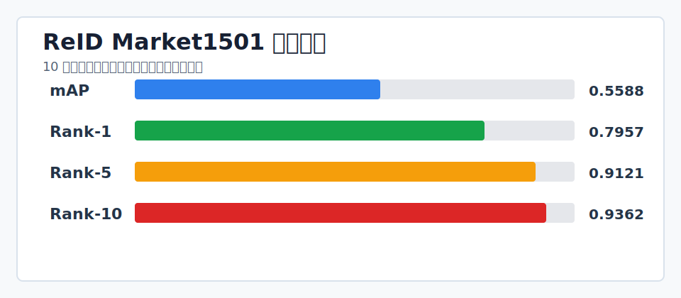

# 行人重识别 ReID 基线项目

这个文件夹实现的是一个基于 Market1501 数据集的行人重识别流程：读取行人裁剪图，训练 ResNet50 特征提取模型，用交叉熵损失和 Triplet Loss 学习行人身份特征，并在 query/gallery 上计算 mAP 与 Rank-k 检索指标。

## 作品集展示



| 维度 | 内容 |
|---|---|
| 技术定位 | 行人重识别训练、评估、图库检索与 API 服务 |
| 指标记录 | Market1501 10 轮训练：mAP 0.5588，Rank-1 0.7957，Rank-5 0.9121，Rank-10 0.9362 |
| 部署链路 | checkpoint -> gallery index -> CLI search -> FastAPI -> Docker |
| 验收 | Python 脚本编译；toy Market1501 可跑通训练和评估链路 |
| 边界 | toy 数据只验证链路；真实部署需业务摄像头数据重新定阈值 |

## 项目结构

```text
reid_baseline/
  configs/reid_config.yaml        # 数据、模型、训练、推理配置
  market1501_loader.py            # Market1501 数据集读取与 PID 重映射
  model/reid_model.py             # ResNet50 + embedding + 分类头
  loss/triplet_loss.py            # Batch 内 Triplet Loss
  train.py                        # 训练入口
  inference/evaluate_reid.py      # 评估入口
  scripts/create_toy_market1501.py# 生成 toy 数据用于冒烟测试
```

## 已完成的流程

1. 读取 Market1501 标准目录：`bounding_box_train`、`query`、`bounding_box_test`。
2. 训练阶段自动把原始 PID 映射为 `0..num_classes-1`，避免 `CrossEntropyLoss` 标签越界。
3. 使用 ResNet50 backbone 输出 512 维 ReID embedding。
4. 联合使用分类交叉熵和 Triplet Loss 训练。
5. 保存包含模型参数、类别数、embedding 维度、PID 映射和配置的 checkpoint。
6. 评估阶段自动加载 checkpoint，在 query/gallery 上计算 mAP、Rank-1、Rank-5、Rank-10。

## 安装依赖

```bash
cd /path/to/reid属性识别系统
python3 -m pip install -r reid_baseline/requirements.txt
```

## 准备真实数据

下载并解压 Market1501 后，目录应类似：

```text
Market-1501-v15.09.15/
  bounding_box_train/
  query/
  bounding_box_test/
```

然后修改 `reid_baseline/configs/reid_config.yaml` 的 `data.root`，或在命令行传入 `--data-root`。

## 训练

```bash
python3 -m reid_baseline.train \
  --data-root /path/to/Market-1501-v15.09.15 \
  --epochs 60 \
  --batch-size 32
```

快速验证真实数据链路时可以只取少量样本：

```bash
python3 -m reid_baseline.train \
  --data-root /path/to/Market-1501-v15.09.15 \
  --epochs 1 \
  --batch-size 8 \
  --num-workers 0 \
  --max-pids 8 \
  --max-images-per-pid 4
```

如果当前环境不能下载 torchvision 预训练权重，可以先用：

```bash
python3 -m reid_baseline.train --data-root /path/to/Market-1501-v15.09.15 --no-pretrained
```

训练完成后默认保存到：

```text
checkpoints/reid_baseline.pth
```

## 评估

```bash
python3 -m reid_baseline.inference.evaluate_reid \
  --data-root /path/to/Market-1501-v15.09.15 \
  --checkpoint checkpoints/reid_baseline.pth
```

快速评估可以限制 query/gallery 数量：

```bash
python3 -m reid_baseline.inference.evaluate_reid \
  --data-root /path/to/Market-1501-v15.09.15 \
  --checkpoint checkpoints/reid_baseline.pth \
  --max-query 32 \
  --max-gallery 128
```

## 没有真实数据时做冒烟测试

先生成一个很小的 Market1501 格式 toy 数据集：

```bash
python3 -m reid_baseline.scripts.create_toy_market1501 --output data/toy_market1501
```

再跑 1 个 epoch，确认训练和评估入口能打通：

```bash
python3 -m reid_baseline.train \
  --data-root data/toy_market1501 \
  --epochs 1 \
  --batch-size 4 \
  --num-workers 0 \
  --device cpu \
  --no-pretrained

python3 -m reid_baseline.inference.evaluate_reid \
  --data-root data/toy_market1501 \
  --checkpoint checkpoints/reid_baseline.pth \
  --batch-size 4 \
  --num-workers 0 \
  --device cpu
```

toy 数据只用于验证代码链路，不代表真实模型效果。

## 部署

部署入口已经补齐，支持图库建索引、命令行检索、FastAPI 服务和 TorchScript 导出。

详细说明见：

- [DEPLOYMENT.md](DEPLOYMENT.md)
- [PERFORMANCE.md](PERFORMANCE.md)
- [DELIVERY_CHECKLIST.md](DELIVERY_CHECKLIST.md)
- [使用说明.md](使用说明.md)
- [算法方法说明.md](算法方法说明.md)
