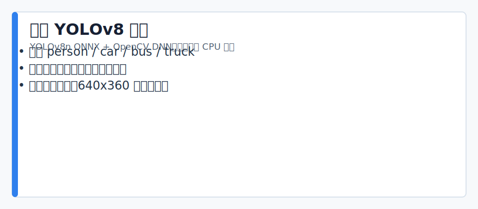

# 基于YOLOv8的轻量化实时行人与车辆检测系统

> YOLOv8n + ONNX + OpenCV DNN，纯CPU推理，无需GPU，适合边缘端部署。

## 功能特性

- 实时检测行人（person）、小汽车（car）、公交车（bus）、卡车（truck）
- 基于 ONNX Runtime / OpenCV DNN，CPU 可流畅运行
- 支持摄像头实时检测、视频文件检测
- Letter-box 预处理，保持原图宽高比
- NMS 后处理，支持自定义置信度与 IoU 阈值

## 作品集展示



| 维度 | 内容 |
|---|---|
| 技术定位 | 边缘 CPU 目标检测基线 |
| 输入 | 摄像头、本地视频、单张图片 |
| 输出 | 检测框、类别、置信度、可选结果视频 |
| 验收 | 脚本编译通过；本地提供 `test.mp4` 和 `yolov8n.onnx` 后可运行视频检测 |
| 边界 | 仓库不携带模型权重和视频；真实场景上线需现场数据评估 |

## 目录结构

```
.
├── detector.py          # YOLOv8Detector 核心类
├── run_camera.py        # 摄像头实时检测入口
├── run_video.py         # 视频文件检测入口
├── onnx_out.py          # 导出 yolov8n.onnx（需要 ultralytics）
├── test_yolo.py         # 单张图片推理测试
├── requirements.txt
└── README.md
```

## 快速开始

### 1. 安装依赖

```bash
pip install -r requirements.txt
```

### 2. 准备模型

方式 A — 直接使用已有的 `yolov8n.onnx`（放入项目根目录）。

方式 B — 从 ultralytics 导出：

```bash
pip install ultralytics
python onnx_out.py
```

### 3. 摄像头实时检测

```bash
python run_camera.py
```

按 `q` 退出。

### 4. 视频文件检测

```bash
python run_video.py --video test.mp4
```

可选参数：

| 参数 | 说明 | 默认值 |
|------|------|--------|
| `--video` | 输入视频路径 | `test.mp4` |
| `--output` | 输出视频路径（可选） | 不保存 |
| `--max-frames` | 最多处理帧数，0=全部 | `0` |
| `--no-display` | 不弹窗，适合无头环境 | 关闭 |

示例——保存检测结果视频：

```bash
python run_video.py --video test.mp4 --output output.mp4 --no-display
```

## 性能参考

| 环境 | 分辨率 | FPS |
|------|--------|-----|
| Intel i5 CPU（无GPU） | 640×480 | 20~25 |
| Raspberry Pi 4（测试） | 320×240 | ~8 |

## 配置说明

在 `detector.py` 中修改 `YOLOv8Detector` 初始化参数：

```python
detector = YOLOv8Detector(
    onnx_model="yolov8n.onnx",
    input_size=640,      # 推理分辨率
    conf_thres=0.5,      # 置信度阈值
    iou_thres=0.45       # NMS IoU 阈值
)
```

## 依赖

```
opencv-python>=4.8.0
numpy>=1.21.0
```

> `ultralytics` 仅在导出 ONNX 时需要，推理时不依赖。

## 许可

MIT
